# Object Detection in an Urban Environment
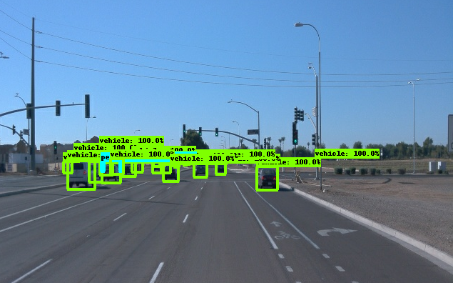

## Project Overview
Object detection is an essential technology for today's self-driving car. Autonomous driving systems use LiDAR and/or infrared cameras to capture the surrounding environment, and detect various road users such as pedestrains, cycles and other cars. This project demenstrates the potential of deep learning, especially convolutional neural network, in detecting and classifying objects within the context of image batches.<br>

This project is carried out as course fulfillment of Udacity Data Scientist Nanodegree Program, in conjunction with Bosch AI Talent Accelerator Scholarship Program.

## Set up
This section contains a brief description of the steps to follow, in order to run the code for this repository. The code can be run either **locally from workspace** or via a **docker container**: <br> 
1. The instructions of building and running the docker container can be found [here](build/). <br> 
2. The instructions of running the program directly from workspace can be found [here](workspace/). <br>

For quickstart, just `clone` this repository with the following command:
```
git clone https://github.com/yapyeetlin/Object-Detection-in-an-Urban-Environment
```

## Dataset
For this project, we will be using data from the [Waymo Open dataset](https://waymo.com/open/). In this repository, 100 datasets are already provided as `.tfrecord` files under `workspace/data`. Here, datasets are split into `train`, `val` and `test` in their respective ratio:<br>
* **train**: 86% or 86 `.tfrecord` files for training the models
* **val**: 10% or 10 `.tfrecord` files for validating the model training process
* **test**: 3% or 3 `.tfrecord` files to test model performance and create inference videos

## Exploratory Dataset Analysis
This section contains a quantitative and qualitative description of the dataset. The codes than runs the `Exploratory Data Analysis` can be found in `Exploratory Data Analysis.ipynb` in the `workspace` folder. Here, we are looking at three object classes in the image: cars, pedestrians and cycles. These objects are marked in rectangle boxes with different color: green (cyclists), red (cars), blue(pedestrians). 
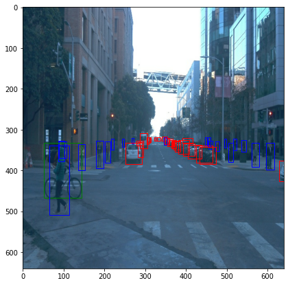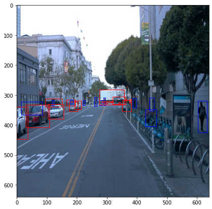

<br> Next, we are investigating the quantitative distribution of each class in the train dataset. Here, 1000 random images from the train dataset are selected:

* Occurance Frequency For Each Class - the occurance of each class in the training dataset 
<br >`1:cars 2:pedestrians 3:cyclists`

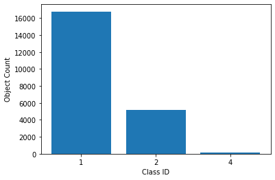

* Object Distribution For Each Class - the distribution of object counts for each class in the training dataset 
<br >`1:cars 2:pedestrians 3:cyclists`

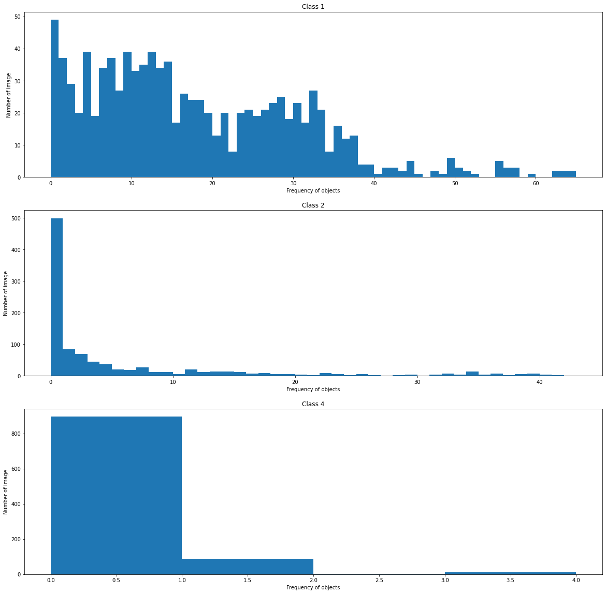

* Object Position Distribution For Each Class - the distribution of object position for each class in the training dataset
<br >`1:cars 2:pedestrians 3:cyclists`

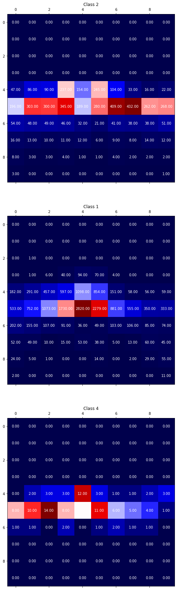


## Training
Model and training hyperparameters are defined in `pipeline_new.config`.
You can make changes in this config file, then move the `pipeline_new.config` to the `/workspace/experiments/reference` folder. Now launch the training process:
* Change to `workspace` directory:
```
cd workspace
```

* Model training:
```
python experiments/model_main_tf2.py 
    --model_dir=experiments/reference/ \
    --pipeline_config_path=experiments/reference/pipeline_new.config
```
Once the training is finished, launch the evaluation process:
* Model evaluation:
```
python experiments/model_main_tf2.py \
    --model_dir=experiments/reference/ \
    --pipeline_config_path=experiments/reference/pipeline_new.config \
    --checkpoint_dir=experiments/reference/
```

**Note**: Both processes will display some Tensorflow warnings, which can be ignored. You may have to kill the evaluation script manually using
`CTRL+C`.

To monitor the training, you can launch a tensorboard instance by running `python -m tensorboard.main --logdir experiments/reference/`. the findings are documented in the following writeup.

## Reference Experiment
We now look at the the results of the reference experiment. The following includes training metrics and a detailed explanation of the algorithm's performances.

* Validation *(left)* vs. real label *(right)*<br>
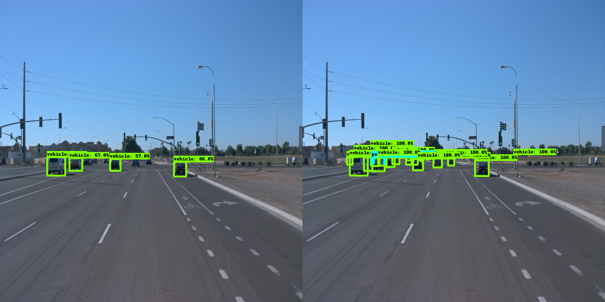

* Performance metrics - training loss *(orange)* vs. validation loss *(blue)*<br>
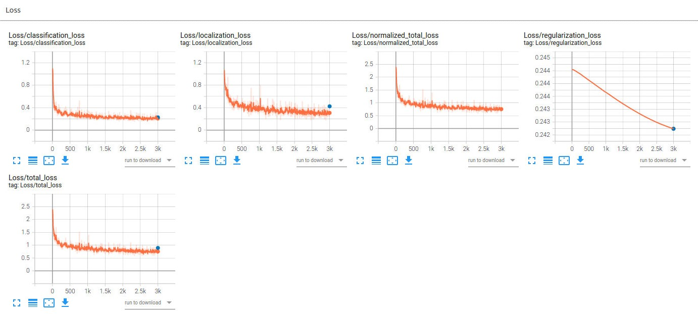

* Performance metrics - model precision on validation data<br>
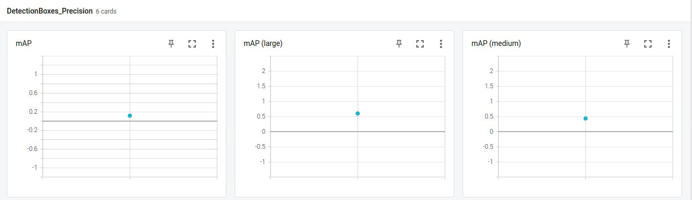

* Performance metrics - learning rate<br>
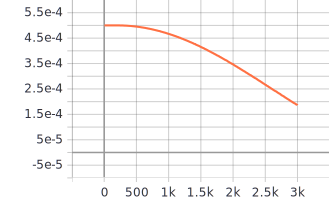


## Data Augmentation
Most likely, this initial experiment did not yield optimal results. To improve model performance, one can induce variability to the training model via augmentation of the images. This is especially useful when the availability of the training dataset is limited. In next experiment, following augmentation techniques are implemented:
* random_horizontal_flip
* random_vertical_flip
* random_adjust_brightness
* random_adjust_contrast
* random_adjust_hue
* random_adjust_saturation
* random_distort_color
* random_RGB_to_Gray

The [`preprocessor.proto`](https://github.com/tensorflow/models/blob/master/research/object_detection/protos/preprocessor.proto) file contains the different data augmentation method available in the `Tf Object Detection API`. To help you visualize these augmentations, we are providing a notebook: `Explore augmentations.ipynb`. A few examples of the augmented images are as followed:

* random_RGB_to_Gray<br>
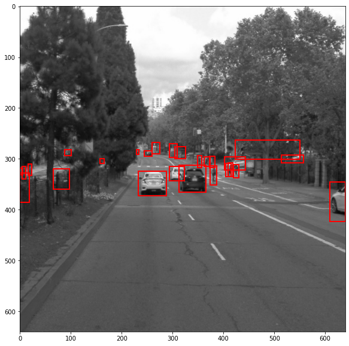

* random_RGB_to_Gray + random_adjust_saturation<br>
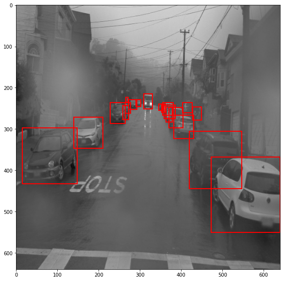

* random_distort_color + random_adjust_saturation<br>
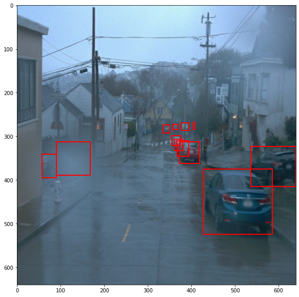

## Final Result
The model performance *before* and *after* data augmentation is illustrated in two inference videos

### **Before Augmentation**
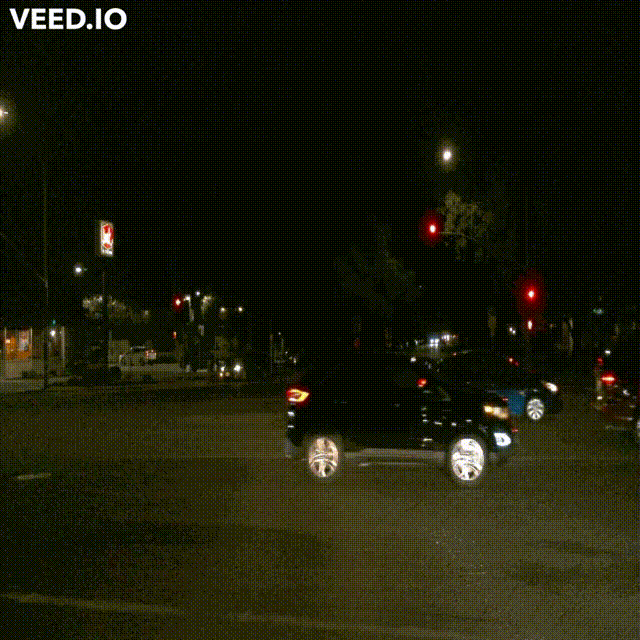

### **After Augmentation**
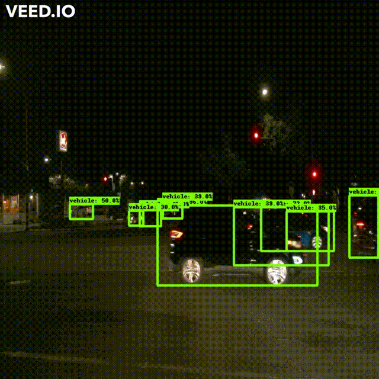

### **Other Test Dataset (After Augmentation)**
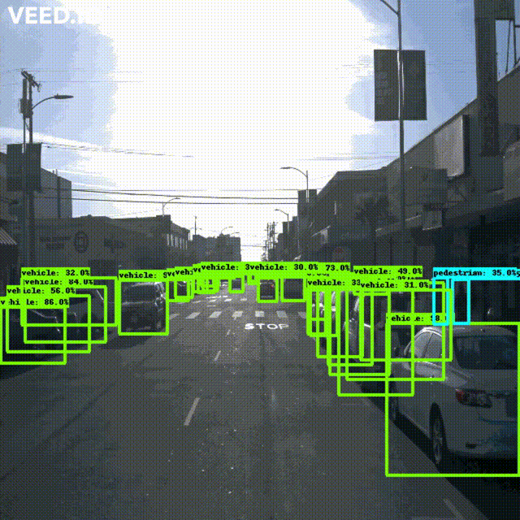

